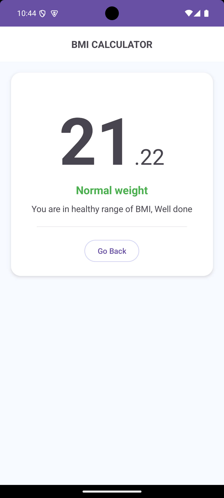

# BMI Calculator App


## Introduction

The **BMI Calculator App** is a user-friendly mobile application designed to help users calculate their Body Mass Index (BMI) based on height and weight inputs. This app provides an easy-to-understand interface, accurate results, and additional information about BMI categories.

## Features

- **Simple UI:** Easy-to-navigate design for users of all ages.
- **Fast Calculations:** Instantly calculates BMI upon entering data.
- **Health Insights:** Displays BMI ca
  <!-- @import "[TOC]" {cmd="toc" depthFrom=1 depthTo=6 orderedList=false} -->
  tegories such as underweight, normal weight, overweight, and obesity.
- **Interactive Graphics:** Engaging visuals and results.
- **Support for Images and Videos:** Includes visuals for better user understanding.

## Demo

### Screenshots

<p align="center">
  
  
</p>

### Video Walkthrough


<video width="50%" controls>

  <source src="./assets/demo_video.mp4" type="video/mp4">
</video>

## Installation

1. Clone the repository:
   ```bash
   git clone https://github.com/kaushalzod/native-bmi.git
   ```
2. Open the project in Android Studio.
3. Build the project to download dependencies.
4. Run the app on an emulator or physical device.

## Usage

1. Enter your height and weight in the respective input fields.
2. Tap the **Calculate** button.
3. View your BMI and health category.

## Technologies Used

- **Java/Kotlin:** For native Android app development.
- **Android Studio:** Integrated Development Environment (IDE).

## Contributions

Contributions are welcome! Please fork the repository, create a branch, and submit a pull request.

## License

This project is licensed under the MIT License. See the [LICENSE](./LICENSE) file for details.

<!-- ## Contact
For questions or feedback, please contact:
- Email: your-email@example.com
- GitHub: [your-username](https://github.com/your-username) -->
